# Project 4: Design Journey

Your Team Name: Blue Deer

**All images must be visible in Markdown Preview. No credit will be provided for images in your repository that are not properly linked in Markdown. Assume all file paths are case sensitive!**

## Client Description

[Tell us about your client. Who is your client? What kind of website do they want? What are their key goals?]

[NOTE: If you are redesigning an existing website, give us the current URL and some screenshots of the current site. Tell us how you plan to update the site in a significant way that meets the final project requirements.]

Our client's name is Wendy. She's a hardworking woman in her mid-20s who is currently working at a resturant in Pennsylvania. Wendy has always been passionate about baking and has enrolled herself in multiple baking courses during her time in China. Now that she feels like she has some experiences working in the food industry, she wants to potentially open up her own online bakery.

She wants a nice website that showcases her sweets. It should include an order form where customers can order sweets and enter their contact information.

## Meeting Notes

[By this point, you have met once with your client to discuss all their requirements. Include your notes from the meeting, an email they sent you, or whatever you used to keep track of what was discussed at the meeting. Include these artifacts here.]

Notes:
**General info about herself:**

- Wendy Jiang- woman in mid-20s
- loved baking since she was a little girl
- took multiple baking classes when she traveled to China about 2 years ago to learn techniques
- skilled in making fondant cakes
- is currently living in Pennsylvania
- is currently working at a resturant and wants to open an online bakery on the side
- wants to one day open up her own physical bakery store

**General info & requirements about the online bakery:**

- bakery name: A Journey to the Sweets
- theme: cute but simple, not too overwhelming
- colors: no special preference on colors, but doesn't want very dark colors for a bakery website
- target audience: teenagers to young adults in their early 30s who are interested in ordering modern & instagrammable cakes for their loved ones.
- purpose of the site: an online bakery business customers can order sweets, pictures that  showcase picture of her baked goods
- primary content: display of all sweets & order form
- interactive elements: a search function (allow the user to sort bakery products by type); forms for ordering items, leaving reviews on orders, and contacting the owner
- client's needs: be able to easily update (add/delete) the database with new sweets
- website complexity: website must be easy to use and the functions of each implementation should be very straightforward; it does not need to be overly-complex

**Other notes:**

- Wenday has provided her website logo to us
- she wants us to check out other successful online bakery business websites for design ideas: my21grams.com, weddingcakes.com
- she has no other specific requirements, as long as the website is functional and aesthetically pleasing

## Purpose & Content

[Tell us the purpose of the website and what it is all about.]

The website will serve as a means through which customers can order sweets from Wendy's online bakery. The online bakery will display a diverse range of sweets including various flavors of cookies, cupcakes, and cakes.

## Target Audience(s)

[Tell us about the potential audience for this website. How, when, and where would they interact with the website? Get as much detail as possible from the client to help you find representative users.]

The target audience will range from teenagers to young adults in their early 30s who are interested in ordering modern & instagrammable cakes for their loved ones. Our site will have a reviews page that contains reviews of all of the bakery's products. There will also be a separate order page for those who are looking to buy speciality cakes/cookies etc. Lastly, we will have an about page for those interested in the history of the bakery as well as a contact page for those with specific questions or requests. Any potential customers will find all of the necessary information on this website.

## Client Requirements & Target Audiences' Needs

[Collect your client's needs and wants for the website. Come up with several appropriate design ideas on how those needs may be met. In the **Rationale** field, justify your ideas and add any additional comments you have. There is no specific number of needs required for this, but you need enough to do the job.]

- Client Requirement/Target Audience Need
- **Requirement or Need** [What does your client and audience need or want?]
  - Client wants to have a way to reach out to potential customers on the internet
  - Client wants to have all of their products available online
  - Client wants bakery information(hours, location, phone number) available online
  - CLient wants to have recipes public for everyone to use
- **Design Ideas and Choices** [How will you meet those needs or wants?]
  - Create a main info/about page that contains the necessary information
  - Use a standard header to link to the other pages (contact, reviews, products, order)
  - Have separate pages that cater to each client requirement
  - Use appropriate HTML/CSS styling, have appropriate fonts, color schemes
- **Rationale** [Justify your decisions; additional notes.]
  - We want to use a simple, easy to navigate design that caters to internet users of all ages
  - We want the front page to have all of the store information and everything else on sub pages
  - Note: not sure if we will/can implement an actual online store

## Initial Design

[Include exploratory idea sketches of your website.]

With this design, we wanted to make the design conducive to ordering and showcasing the items of the bakery.

Our design sketches:

Landing Page: about the bakery and its services.
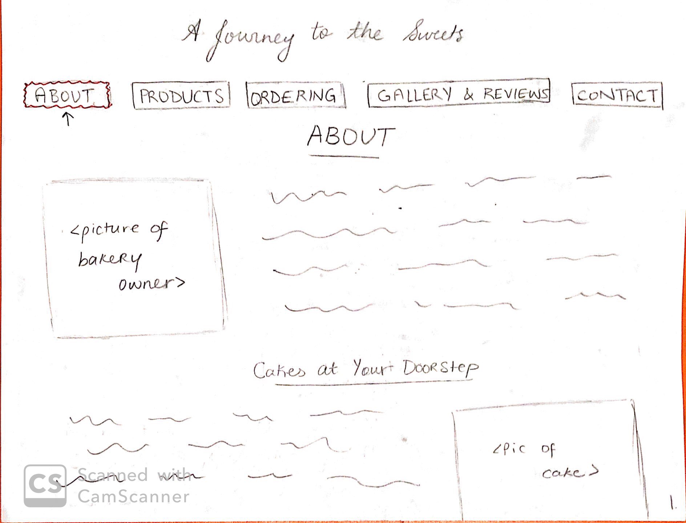

Products Page: lists all the products available in the bakery (from database).
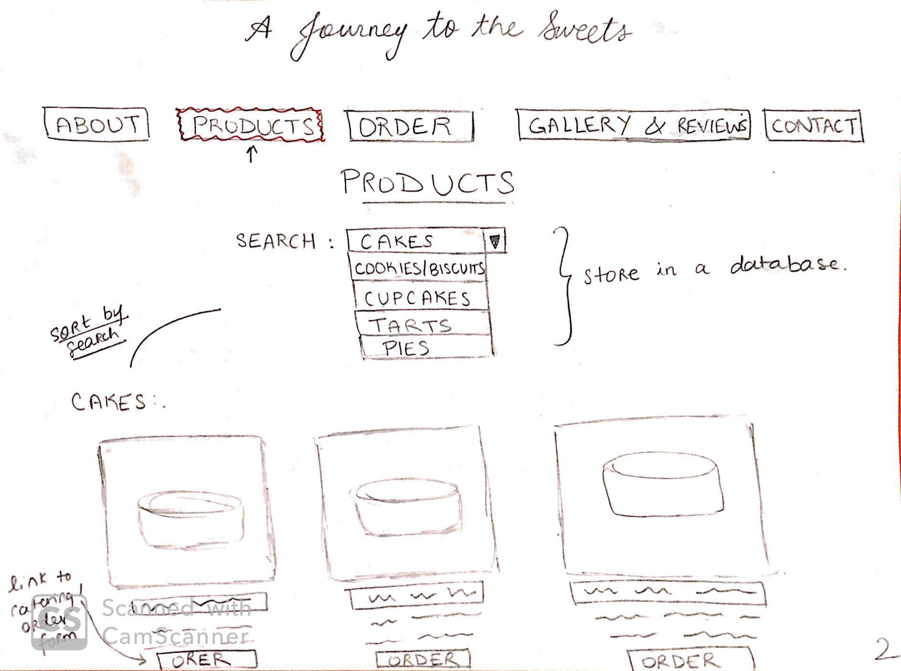

Ordering Page: form for users to place order.
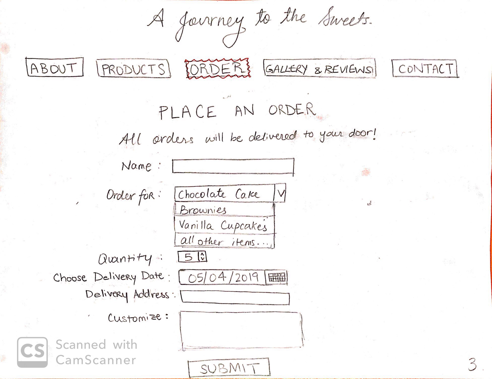

Reviews Page: reviews from customers.
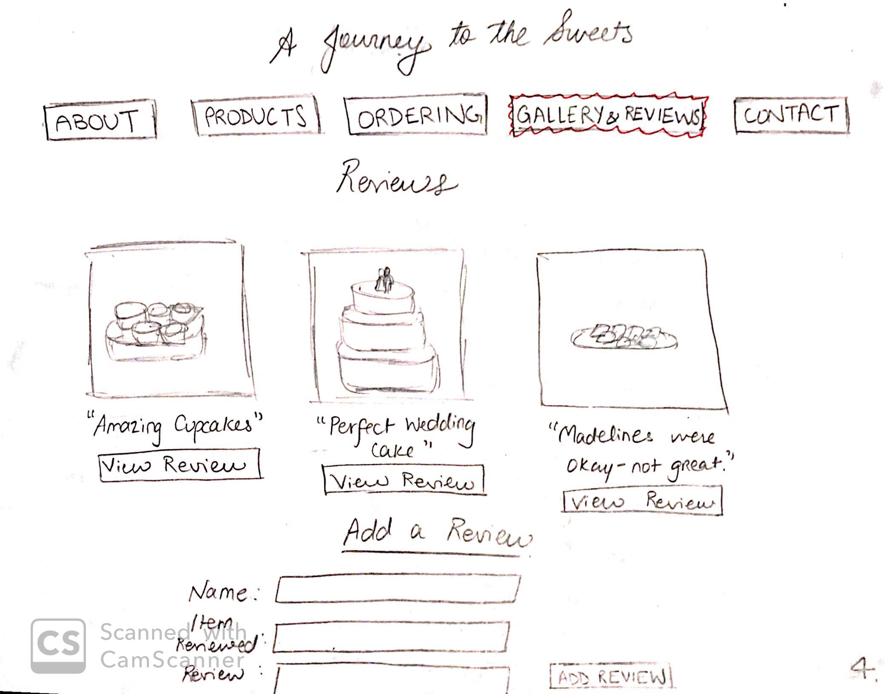

Contact Page: contact form.
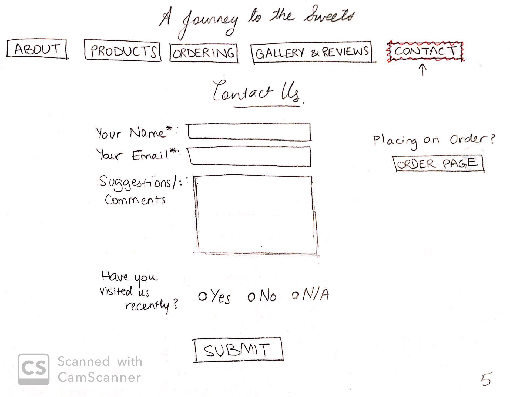

## Information Architecture, Content, and Navigation

[Lay out the plan for how you'll organize the site and which content will go where. Note any content (e.g., text, image) that you need to make/get from the client.]

[Document your process, we want to see how you came up with your content organization and website navigation.]

[Note: There is no specific amount to write here. You simply need enough content to do the job.]

Example:

- **Navigation**

  - About
  - Products
  - Ordering
  - Reviews
    - Individual product review page for each item
  - Contact

- **Content** (List all the content corresponding to main navigation and sub-categories.)

  - _About_: Provides information about the owner of the page and a photo of the owner, as well as information about the bakery.
  - _Products_: Showcases all of the owner's products in a gallery (images). Contains a search bar which allows the user to search/filter the gallery by product type. Each item will also have a link taking the user to the order page. This make it easier and more intuitive for the user to find/choose the correct product they are looking for, because on the ordering page you must name the item you want by name, not image.
  - _Ordering_: Provides a form for the user to order any bakery item. The form required the user to input relevant information, such as pick up date, name, item type, and quantity.
  - _Reviews_: Showcase customer reviews and a form at the end of the review page allowing a user to leave a review of a product. Any user can upload a review (no login necessary to aid uability). The admin can then login and delete any reviews she wants.
  - _Contact_: Contains a form which allows users to contact our client, leaving their name, email, and comments/suggestions. There will also be a link to the order page to redirect the user in case they thought they needed to order by contacting the owner of the site.

- **Process**
  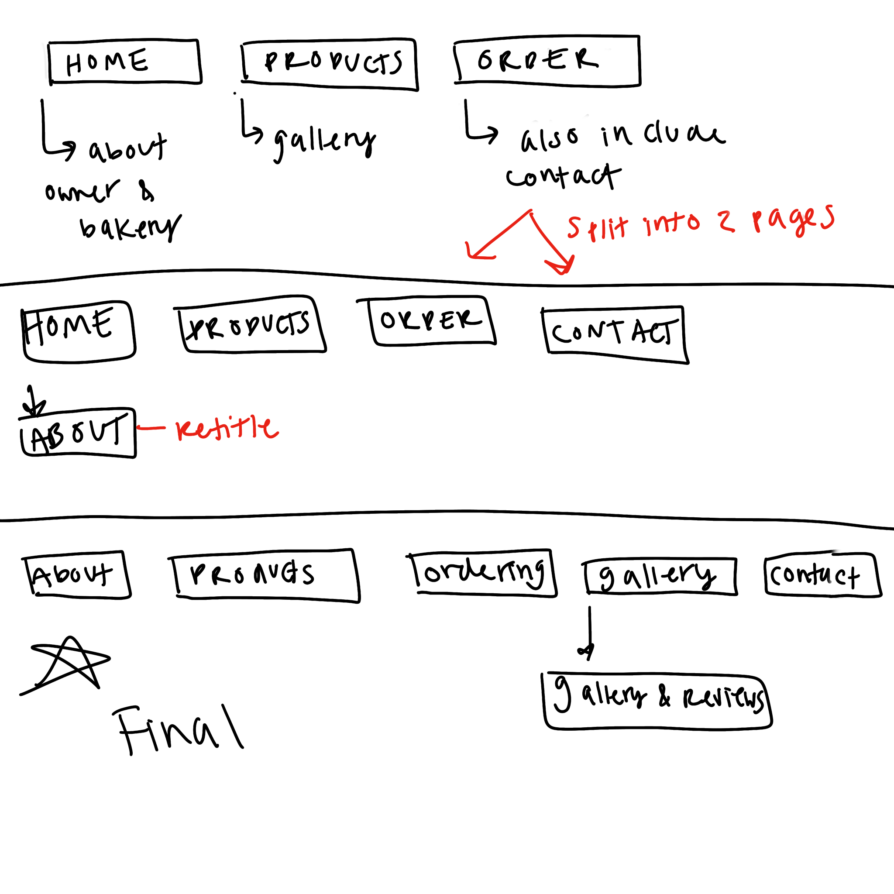
- The design of our navigation progressed because we initially wanted to put too much content in each page. The first change we made from the initial design was changing the "home" button to be called "about" because we realized that that was more descriptive of the page content. We then decided to split the order tab into two page, "contact" and "order" because we thought it would be clearer to seperate those forms as they have very different purposes. We also recieved a lot of images from our client, so we thought it would be best to have another page, the gallery, where we could display more images of the product (more candid photos). The products page is necessary as it helps the user with the ordering process. The gallery page helps coerce the user into buying products. We added reviews to the gallery page to further distinguish its purpose from the products page. The "gallery and reviews" page also adds an interactive quality to the site, as users can add reviews about the products they buy. This also may help our client to sell more product because users will be more trustworthy of the client, and feel more comfortable buying their baked goods online from her.

## Interactivity

[What interactive features will your site have? What PHP elements will you include?]

We will have a search function, which will allow the user to sort bakery products by type. We will also have forms for ordering items, leaving reviews on orders, and contact. These features will be accessed through the header navigation bar of our site, which will be part of our includes. We will also add admin privileges to our site. For instance, the admin will be able to edit descriptions on the about and terms pages. Also, the admin will be able to add new products to the shop and view orders placed by customers.

[Also, describe how the interactivity connects with the needs of the clients/target audience.]

Firstly, the header makes navigation of the site feasible to the target audience.

Additionally, there are search functions in place to help users more easily find the items they are looking for. For example, on the reviews gallery page, users can search through the reviews to find reviews on the product they are looking for more easily. This will prevent them from needing to go through all the reviews to find what they are looking for.

The Shop page allows users to view different items and click on the item they want to purchase. Instead of having to navigate to a different page to submit the order form, users can click on the order button on the same page and be redirected to the form.

On the Review Gallery page, users can submit, edit, delete, and view different reviews. Users can log in to upload reviews and view the reviews that they have submitted. In addition, users can add reviews and edit existing reviews by adding more images to the reviews if they want. They also have the option to search through all the reviews, delete reviews if they want, or just delete specific images from reviews.

The target audience is of a younger age-range and relies more heavily on reviews and user communities online that share reviews and images, so the review gallery will allow this target audience to trust this bakery and its products more.
The order form allows the target audience to purchase items from the online bakery, while it allows the client to maintain her business. The review form provides the client a sense of legitimacy to her business, which can help the business grow. As a result, the review form also allows the target audience to provide input and see others. Also, the contact form allows the client and target audience to communicate.

Also, the admin privileges connects with the needs of the client. It allows the client to customize her site and manage her business in the future.

## Work Distribution

[Describe how each of your responsibilities will be distributed among your group members.]

[Set internal deadlines. Determine your internal dependencies. Whose task needs to be completed first in order for another person's task to be relevant? Be specific in your task descriptions so that everyone knows what needs to be done and can track the progress effectively. Consider how much time will be needed to review and integrate each other's work. Most of all, make sure that tasks are balanced across the team.]

    Currently, we plan to split responsibilities evenly. We have discussed our strengths as a group (some of us are stronger in back-end, others in styling and html, others in databases), so if any one of us needs help, we can help each other based on our strengths. Otherwise, however, we are not splitting up work by categories and will each do a bit of everything in the project. We will enforce these responsibilities by meeting weekly and clearly assigning a task to each member. For this milestone, Pei worked on with the client sections, Kevin worked on the target audience section, Nighat worked on the design and sketches, Kim worked on the architecture/content/navigation section, and Alice worked on the interactivity section and fixing up the milestones after feedback was given. For implementing the project, we will split up by pages. Pei will work on the home and contact pages, Kim will work on the shop page, Nighat will work on the gallery/reviews page, Alice will work on the about page, and Kevin will work on the terms page. Any additional work will be given to people whos pages are simpler. For instance, Kevin will help implement login on each page and Alice will implement some admin privileges for the client as well as testing/debugging the website.

## Additional Comments

[If you feel like you haven't fully explained your design choices, or if you want to explain some other functions in your site (such as special design decisions that might not meet the final project requirements), you can use this space to justify your design choices or ask other questions about the project and process.]

To clarify, our "order form" will not be a real order form in the sense that we won't be implementing a real "shop" of sorts. Instead, it will just be a form collecting the details of a customer's order, which will be inserted into an "orders" table. Since baked goods are made to order, we will not be using an inventory.

--- <!-- ^^^ Milestone 1; vvv Milestone 2 -->

## Client Feedback

**General feedback**

- Prefers the landing page to show all the sweets (lots of pictures) rather than information about the bakery owner since the website is an online bakery business and the goal is to attract/retain customers
  - Maybe name the landing page as “Home” and show some nice pictures of desserts from different categories + quick links to other pages
- “About” page is a good idea but prefers to place it before “Contact”
- Having separate pages for “Products” and “Ordering” seems inefficient — maybe they could be combined into one page so it’s easier for customer to see which products are available and ready for order
  - Can potentially name the combined page as “Shop”
- Wants a Terms & Policy page to show all the shipping/return policies as well as payment methods
- Loves Gallery & Reviews
- Likes the “Contact” page
  - some minor changes: instead of “suggestions/comments,” maybe write “Inquiries” instead
  - Maybe have a line of instructions saying something like “please contact us if you have any questions regarding your orders or group discounts”
  - Likes the link to the order page, but it looks a little out of place on the side, maybe put it at the bottom of the page instead?

**Outline of desired website layout**

- Home: landing page that showcases lots of desserts, contains quick links to other pages (we can use image icons?)
- Shop: display of all the dessert categories, contains order form
- Gallery & Reviews: gallery of sweets ordered by customers & their reviews
- About: background info on the owner & bakery
- Contact: contact form
- Terms & Policy: show all the shipping/return policies as well as payment methods

## Iterated Design

Based on the feedback we received from the client, we have made some changes to our design.

Our revised design sketches:

Landing Page:

- 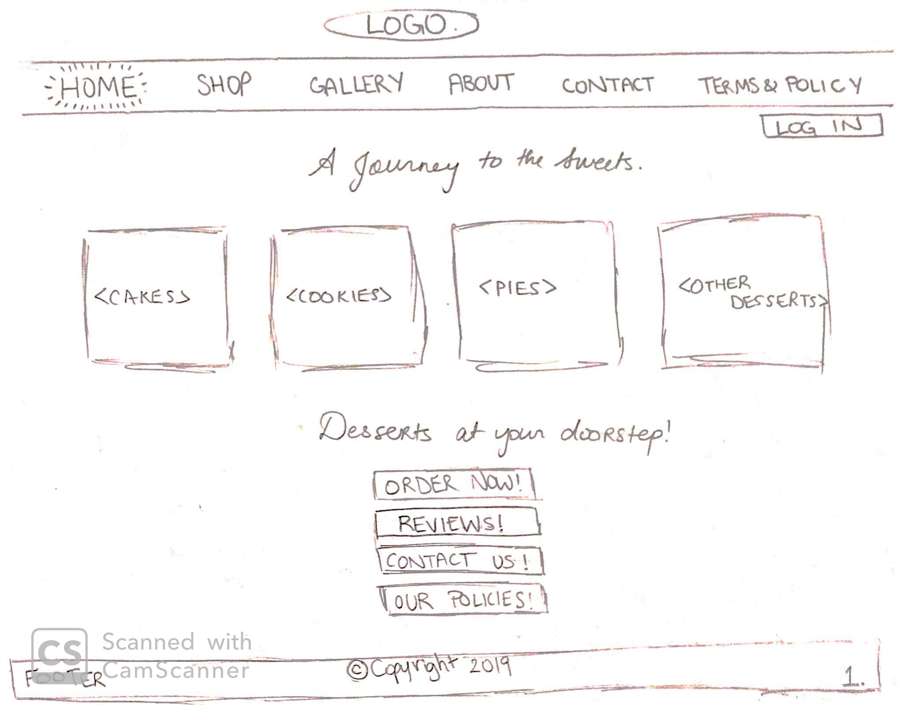

Shop Page: lists all the products available in the bakery (from database).

- 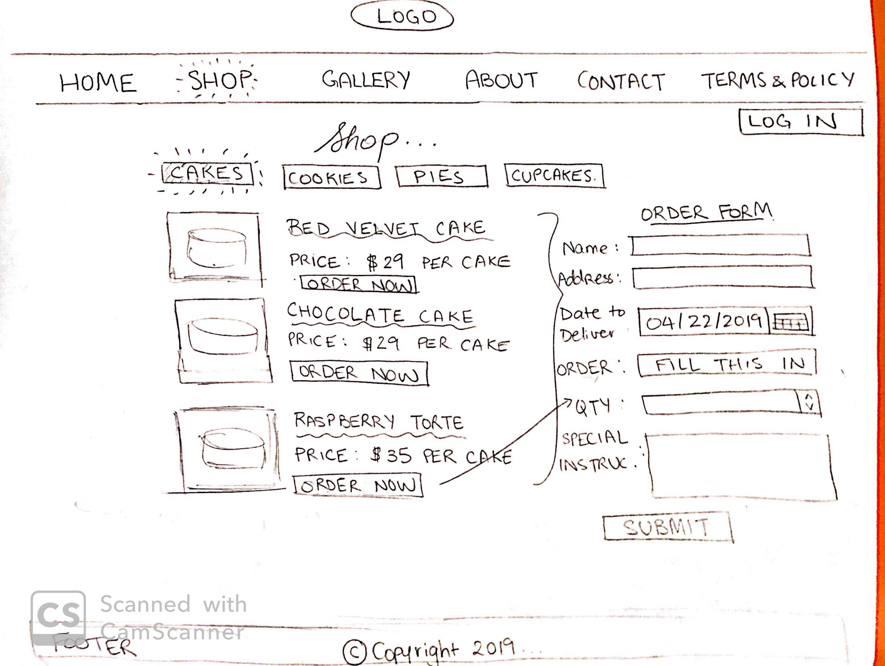

Reviews Page: reviews from customers.

- 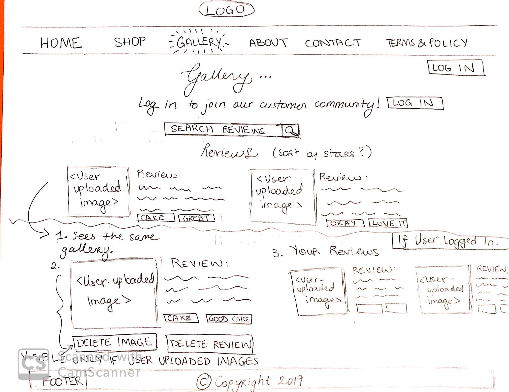

About Page: about the bakery and its services.

- 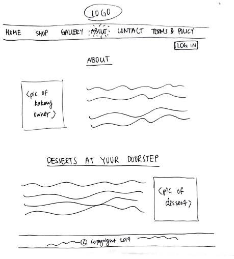

Contact Page: contact form.

- 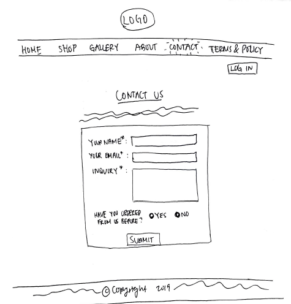

Terms & Policy Page: shipping, returns, and payment policies.

- 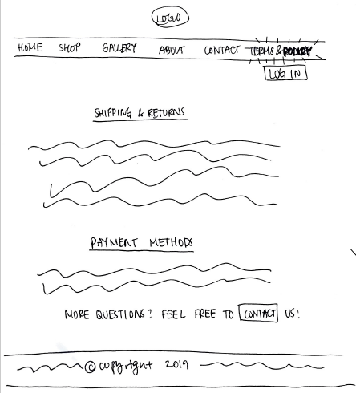

## Evaluate your Design

[Use the GenderMag method to evaluate your wireframes.]

[Pick a persona that you believe will help you address the gender bias within your design.]

We've selected Abby as our persona because we believe she best represents our target audience. People that go on our website may struggle with basic webpage navigation or do not want to spend too much time figuring out how to navigate the site.

Abby Personality Traits: Likes music, exercise, and sudoku, scans all emails before replying to any, "numbers person", works as an accountant, low confidence with unfamiliar tasks, comprehensive information processing style, process oriented learning, doesn't like tinkering

### Tasks

[You will need to evaluate at least 2 tasks (known as scenarios in the GenderMag literature). List your tasks here. These tasks are the same as the task you learned in INFO/CS 1300.]

[For each task, list the ideal set of actions that you would like your users to take when working towards the task.]

Task 1: Abby's friend is throwing a party next weekend. Abby is asked by her friend to order and bring a specific cake for the party.

1. Subgoal 1: Order the cake

- Action 1A: Click on "Shop" tab in the navigation bar.
- Action 1B: Click on preferred bakery item type.
- Action 1C: Scroll to preferred bakery item.
- Action 1D: Click on "Order Now" button
- Action 1E: Enter name as input.
- Action 1F: Fill out address.
- Action 1G: Select delivery date.
- Action 1H: Check item to order.
- Action 1I: Select quantity.
- Action 1J: Fill out customization if necessary.
- Action 1K: Submit form.

Task 2: Abby's daughter's birthday is coming up soon. She needs to buy something for the party but is unsure of which item to order.

1. Subgoal 1: Look through gallery

- Action 1A: Click on "Gallery" tab in the navigation bar.
- Action 1B: Scroll through gallery.
- Action 1C: Type keyword into search bar.
- Action 1D: Scroll through filtered reviews.

2. Subgoal 2: Order an item (Same as in task 1)

- Action 2A: Click on "Shop" tab in the navigation bar.
- Action 2B: Click on preferred bakery item type.
- Action 2C: Scroll to preferred bakery item.
- Action 2D: Click on "Order Now" button
- Action 2E: Enter name as input.
- Action 2F: Fill out address.
- Action 2G: Select delivery date.
- Action 2H: Check item to order.
- Action 2I: Select quantity.
- Action 2J: Fill out customization if necessary.
- Action 2K: Submit form.

### Cognitive Walkthrough

[Perform a cognitive walkthrough using the GenderMag method for all of your Tasks. Use the GenderMag template in the <documents/gendermag-template.md> file.]

#### Task 1 - Cognitive Walkthrough

**Task name: [Abby's friend is throwing a party next weekend. Abby is asked by her friend to order and bring a specific cake for the party.]**

**Subgoal # [1] : [Order the cake]**

- Abby would have likely formed this as a subgoal because in order to get a cake, it would make sense to have "ordering the cake" as a subgoal. She is the type of person to look at every page before doing anything else so she may not go directly to the shop page - she may browse the products or reviews pages first. Since Abby uses technologies to accomplish her tasks (ordering a cake for her friend), she would have formed this subgoal.

**Action # [1] : [Click the shop tab]**

- Will [Abby] know what to do at this step?

- Yes, it is very likely that Abby would know to click on the "shop". Since she learns with a comprehensive information processing style, even if she visited every page of the website it would be obvious that the shop page is the right one. It will show the available options and the order form. Abby may not know at first that this is the right first step, but she will know it is the right one if she has visited all of the pages. Since the shop page shows the different shop products, Abby will know she made progress toward her goal.

**Action # [2] : [Click on preferred bakery item type.]**

- Yes, Abby will know what to do because at the top of the shop page, there will be buttons for different bakery items. There will be a cake option and she wants a cake, so it would make sense to click this button. Since these will be at the top of the screen and the first thing Abby will see, she will likely already be familar with this technology/method, which fits her motivations. After the cake button is clicked, she will know that she's on the right track because the cake products will appear on the screen.

**Action # [3] : [Scroll to preferred bakery item.]**

- Once the different cakes appear on the screen, Abby will scroll down to the one that she wants. There will be a picture of the cake, the price, and the name. The product she is looking for will be listed on the page, so she should be comfortable with scrolling to that product. She will know she's making progress, because she will see the different cake products on the page as she scrolls through the page. There will also be an order now button which will make the order form appear. She will know that she's on the right track after click this button.

**Action # [4] : [Click on "Order Now" button]**

- Abby will know to click on the order now button after she has scrolled to the proper selection. Clicking this button will make the order form appear to the right. This may not be 100% obvious but we will do our best to make sure this is clear on the website.

**Action # [5] : [Fill out name]**

- Yes, Abby will know what to do because filling out your name is the first input, she will then look at the next input option. She is the type of person to do things one at a time and this is the first available input.

**Action # [6] : [Fill out address]**

- The next input option is the address. Abby will likely choose her own address and then move on to the last input, customization. Abby knows she made the correct action and she is getting closer to reaching her goal. She is the type of person to do things one at a time and this is the next available input.

**Action # [7] : [Select delivery date]**

- The next input option is the delivery date. She is the type of person to do things one at a time and this is the first available input. Abby will choose the proper delivery date and move on to the next option. Abby knows she made the correct action and she is getting closer to reaching her goal.

**Action # [8] : [Check the order entry]**

- Since the next input option is the order entry which should already be filled in from when the order now button. Abby can confirm that she is on the right track if the name of the order is the item that she wants to order.

**Action # [9] : [Select quantity]**

- The next input option is the quantity. Since Abby only wants one cake, she will select "1". Abby knows she made the correct action and she is getting closer to reaching her goal.

**Action # [10] : [Fill out customization]**

- The last input option is the customization text box. Here, Abby can add in special text like "happy birthday". This part may not be intuitive, so Abby might not know what to do, but we will add placeholder text in the text box with examples. Abby knows she made the correct action and she is getting closer to reaching her goal.

**Action # [11] : [Submit form]**

- Lastly, Abby must click the submit button. The button will be either green or blue and at the bottom of the form so it's impossible to miss. She is the type of person to do things one at a time and since she has filled in every input, she will be confident she can click the submit button. She will know that she is done because there will be a confirmation page after the submit button is clicked.

#### Task 2 - Cognitive Walkthrough

**Task name: [Abby's daughter's birthday is coming up soon. She needs to buy something for the party but is unsure of which item to order.]**

**Subgoal # [1] : [Look through gallery]**

- Since Abby is the type of person to look at everything and try to form a complete understanding, she will likely look at the gallery page and see the options that she has. This may not be a specific sub goal of Abby's, since she might not think that a gallery of product images will help her make a decision. However, once she is on the gallery page, she will defintely look at all of the gallery images and reviews before making any further decisions, which fits her information processing style.

**Action # [1] : [Click on "Gallery" tab in the navigation bar.]**

- Abby may have not known to specifically click on the gallery tab, but she is the type of person to look at every page, since she gathers information comprehensively. Once she reaches the gallery page she will know that it's useful because she can figure out what her options are. Abby should know that she's on the right track after clicking on this tab.

**Action # [2] : [Scroll through reviews]**

- Once Abby is on the actual gallery page, whe will likely scroll through all of the options. Since she is unsure of what she wants to get, she can figure out which options she likes best. This page fits well with Abby's information processing style. She will know that she is on the right track once she sees an option that she likes. She will also see all of the reviews that people write to get a better understanding about each product

**Action # [3] : [Type keyword into search bar.]**

- All of the products will be shown when the gallery page loads, but there will also be the option to search for the specific product that she wants. This should be intuitive because it is at the top of the screen and there will be "search reviews" text. If Abby is unsure of what to buy, she will use the search function because she gathers information comprehensively. Abby will know she is on the right track after seeing her preferred product types show up in the field below.

**Action # [4] : [Scroll through filtered reviews.]**

- Once the page reloads, Abby will scroll throught the refined products to choose the one that she wants. Again she will see the products that she might be interested and read the reviews. She will know that she is on the right track because she has a much better understanding/opinion of all of the intriguing products. After finalizing her opinion, she will go to the shop page, where the steps are the same as the ones from task 1.

**Subgoal # [3] : [Order an item (same as before, from task 1)]**

- After reaching the orders page, the actions the same as the ones from task 1.

### Cognitive Walk-though Results

[Did you discover any issues with your design? What were they? How will you change your design to address the gender-inclusiveness bugs you discovered?]

Yes, we discovered a couple of issues with our design so we ended up redesigning a couple pages. After talking to our client, we realized that she wanted six separate pages, with a Terms & Policy page which we did not previously include. The home, about, and contact pages stayed pretty similar, but we made design changes to the shop and gallery pages. We wanted to make both of these pages intuitive and easy to navigate without overlapping the functionality. The shop page is now specifically for orders and the gallery page only has images and reviews. It was a little confusing in our orginal design because orders could be made from both pages. Now, if a customer wants to look at all of the baked goods available, they can look in the gallery page and also read reviews about every product. Once they have made their decision, they can click on the shop page to actually make the order. Our new design is much makes these two pages separate and the functionality is no longer ambiguous. In terms of gender-inclusiveness, we wanted to make our overall site very intuitive, even for users like Abby. Each page is unique, has a purpose, and is easy to navigate. We made sure that people who didn't use computers/internet much could easily browse the shop and end up ordering a cake. However, we discovered that some part of our website's layout might not be very intuitive for someone like Abby, who does not have time to tinker with the site. For instance, the gallery tab might be misleading, because it's actually for reviews that might have images that make up a gallery. To address this issue, we will rename the tab to just "reviews."

## Final Design

Our finalized design sketches (after cognitive walkthrough and feedback lab session):

Landing Page: slideshow of desserts.

- 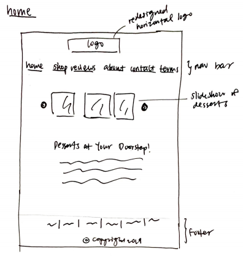

Shop Page: lists all the products available in the bakery (from database) that users may place an order for.

- 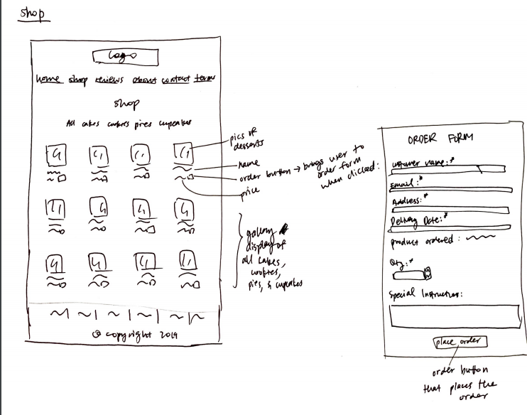

Reviews Page: a gallery of reviews from customers, add reviews & images form.

- 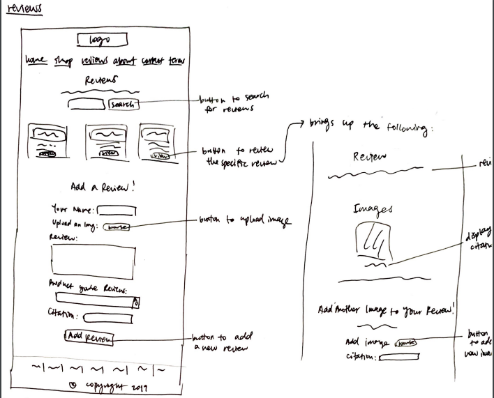

About Page: about the bakery and its services.

- 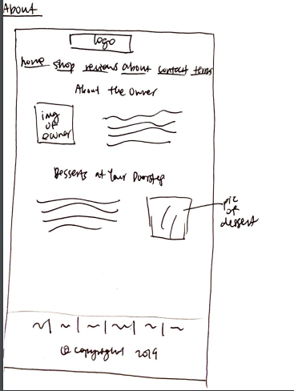

Contact Page: contact form.

- 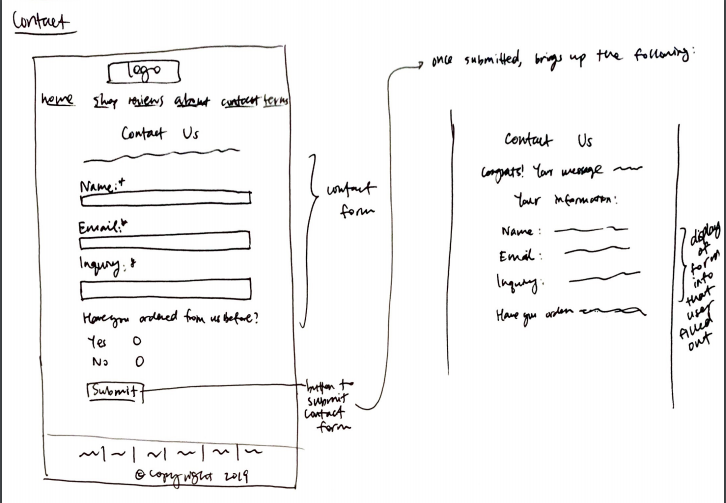

Terms & Policy Page: shipping, returns, and payment policies.

- 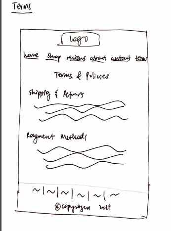

Login Page: user login.

- 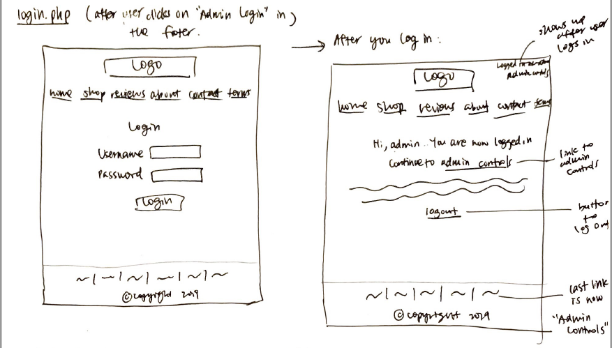

Admin Page: admin controls.

- 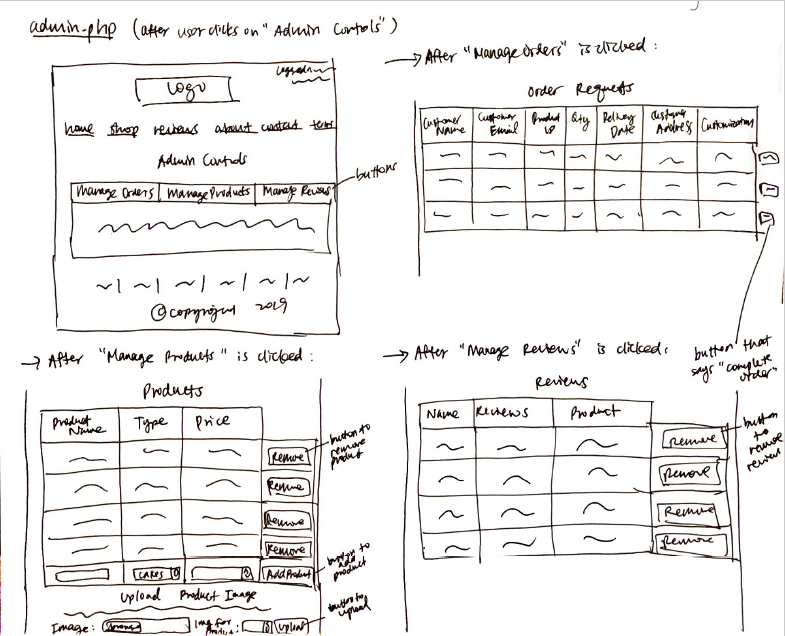

Logout display at the top-right corner of every page after user logs in:

- 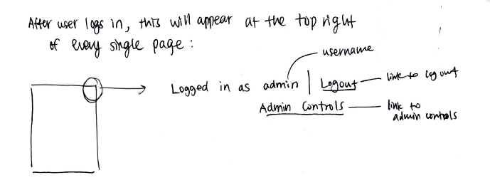


[What changes did you make to your final design based on the results on your cognitive walkthrough?]

Our revised sketches above (in the client feedback section) reflect changes we made based on the client feedback, as well as our cognitive walkthrough. For example, when we first began working on the webpages, we had the order page and the list of products separate. When the client suggested that we merge those pages together to make it easier for the user to place an order, we realized that a persona like Abby may have also found it confusing to try and order on a separate page. Since Abby is a process-oriented thinker and learner, she does not like to tinker with technology and also tends to be risk-averse because of her schedule. In that case, she will not have time to browse all the different tabs of a website before she gets frustrated or blames herself for being unable to find the order page (since it is not located close to the products page). Thus, our revised sketches merged the order and products pages into one "Shop" page.

Another functionality we implemented based on the cognitive walkthrough is making reviews searchable. Someone like Abby's persona is risk-averse and has limited time. In that case, they will be unlikely to look through each individually listed cake or baked good on the website. Instead, it would be helpful for Abby, who has a more structured and risk-averse approach to problems, to be able to search in advance for the cake she is looking for whether it be a certain flavor or have a certain rating etc. Additionally, we decided to add "reviews" to the navigation bar, because the name "gallery" might confuse Abby, since she does not have time to spare tinkering with the website. We also decided to rename the page from gallery.php to reviews.php, which reflects the navigation bar change.

In addition, after receiving feedback from peers during lab, we decided to add more interactivity to our website and make some final touches to our websites design. We added an admin page, which allows the client to manage orders, products, and reviews. One thing brought up at the feedback session was that anyone should be able to add a review (not just a user logged in), or that we should verify customers so they review the proper items. We chose the former and modified our seed data to reflect this change. Finally, we made the admin controls more easily accessible.

Once again, the updated sketches above reflect feedback from the client and peers as well as the cognitive walkthrough.

## Database Schema

Table: products

- field 1: id : INTEGER {PK, U, Not, AI} -- surrogate primary key
- field 2: product_name: TEXT {U, Not}
- field 3: product_type_id: INTEGER {Not}
- field 4: price: INTEGER {Not}

Table: about_bio

- field 1: id : INTEGER {PK, U, Not, AI} -- surrogate primary key,
- field 2: bio_text TEXT {Not}

Table: about_services

- field 1: id: INTEGER {PK, U, Not, AI} -- surrogate primary key,
- field 2: services_text TEXT {Not}

Table: terms_pay

- field 1: id : INTEGER {PK, U, Not, AI} -- surrogate primary key,
- field 2: payment_text TEXT {Not}

Table: terms_ship

- field 1: id : INTEGER {PK, U, Not, AI} -- surrogate primary key,
- field 2: shipping_text TEXT {Not}

Table: product_types

- field 1: id : INTEGER {PK, U, Not, AI} -- surrogate primary key
- field 2: type: TEXT {U, Not}

Table: product_images

- field 1: id : INTEGER {PK, U, Not, AI} -- surrogate primary key
- field 2: file_ext : TEXT {Not}
- field 3 : file_name: TEXT {Not}
- field 4: product_id: INTEGER {Not}

Table: orders

- field 1: id : INTEGER {PK, U, Not, AI} -- surrogate primary key
- field 2: customer_id - INTEGER {Not}
- field 3: customer_email - TEXT {Not}
- field 4: product_id - INTEGER {Not}
- field 5: quantity - INTEGER {Not}
- field 6: delivery_date - DATE {Not}
- field 7: address: TEXT {Not}
- field 8: customization: TEXT

Table: users

- field 1: id: INTEGER {PK, U, Not, AI} -- surrogate primary key
- field 2: username : TEXT {U, Not} -- foreign key
- field 3: password : TEXT {U, Not}
- field 4: customer_name: TEXT {Not}

Table: reviews

- field 1: id: INTEGER {PK, U, Not, AI} -- surrogate primary key
- field 2: name: TEXT {Not}
- field 3: product: TEXT {Not}
- field 5: review: TEXT {Not}

Table: customer_images

- field 1: id : INTEGER {PK, U, Not, AI} -- surrogate primary key
- field 2: file_ext : TEXT {Not}
- field 3 : file_name: TEXT {Not}
- field 4: citation: TEXT {Not}
- field 5: review_id : INTEGER {Not}

Table: sessions

- field 1: id : INTEGER {PK, U, Not, AI} -- surrogate primary key
- field 2: user_id : INTEGER {Not} -- foreign key
- field 3: session: TEXT {U, Not}

## Database Queries

- admin login
  - check if password matches password for username key in db
  - if so, create a session and add session to db
  - if logout link pressed, end current session
  - allow access to admin control page, show link to page in footer
- search products
  - display all products images and product names for the specified product type
- order form
  - show order form for specific product selected by user from shop page
  - Insert all information from order form into order table
- add review
  - check if review for the specified product already exists by querying sql review table
  - insert into reviews
  - find product id based on product name
    - "INSERT INTO reviews (customer_id, product_id, review) VALUES (:current_user_id, :product_id, :review_text";
- upload image
  - Only allow upload functionality for reviews in which the user uploaded
  - "INSERT INTO customer_images (file_ext, file_name, user_id) VALUES (:upload_ext, :file_name, :current_user_id);"
- delete review
  - only afford deletion for reviews posted by the user
  - Delete the review from the table based on review id
  - get file extensions of images with same review id for unlinking image from disk
  - delete all images from the customer_image table whos entries contain that review_id
- display all product images on products page
  - Select all product names from products table
  - Select all images from product images table
- Display product information for single image view
  - query product table for given product id
  - query product_images table for for given product id to display product image
- About page
  - when admin logged in, allow her to update her about bio by performing an update transaction
- Admin Page
  - when admin logged in:
    - display all customer orders
      - allow admin to "complete" an order, which deletes the order request from the db
    - allow admin to add new products and product images
      - unlinking image from disk when product deleted
    - allow admin to delete products and product images
    - allow admin to delete customer reviews and images

## PHP File Structure

[List the PHP files you will have. You will probably want to do this with a bulleted list.]

- includes/init.php - stuff that useful for every web page.
- includes/head.php - head template for every web page.
- includes/header.php - logo and navigation template for every web page.
- includes/footer.php - footer template for every web page.
- index.php - main page.
- shop.php - various desserts for sale and order form.
- reviews.php - reviews of desserts.
- about.php - about the bakery owner and history of bakery.
- contact.php - contact form template.
- terms.php - terms and policies.
- admin.php - allows admins to make changes to the site.
- login.php - allows user to login.

## Pseudocode

[For each PHP file, plan out your pseudocode. You probably want a subheading for each file.]

### index.php

```
Pseudocode for index.php...

include init.php
include head.php
include header.php
add photo for each bakery product item and corresponding link to shop page
include footer.php

```

### about.php

```
include init.php
include head.php
include header.php

create columns to display images and descriptions

display owner image on left
display owner description on right
if admin is logged in: display edit button for owner description
if admin clicks on edit button, display owner description in textarea and a save button
if admin clicks on save button, update description (sql query) and display like before with edit button

repeat the same steps for services description (except image is on right and text is on left)

include footer.php

```

### terms.php

```
include init.php
include head.php
include header.php

create block of text for shipping and returns
if admin is logged in: display edit button for shipping/returns description
if admin clicks on edit button, display the description in textarea and a save button
if admin clicks on save button, update description (sql query) and display like before with edit button
create block of text for payment methods (repeat same steps as shipping/returns)

include footer.php
```

### shop.php

```
include init.php
include header.php

- create unordered list of products
- display each product name, price, and a button to order
- order button gives a query string to an order form specifically for that product
  -create order form which provokes a sql insert statement, and inserts a product order entry into the orders table
  -Calculates price by multiplying amount of purchased items times the item price and displays in form response
- create search tabs at top of page which makes a query string and displays only the products for that category

```

### reviews.php

_General idea behind this page_: Since this is a reviews section aimed at documenting the different reviews uploaded, this page is designed to have add functionalities for the user and delete functionalities for admin. The page also has search functionality.

```
include init.php
include head.php
include header.php

- Create two tables: reviews and customer_images to store the images and reviews.

- Searching Reviews
    - create a form that displays a search bar and  all possible search categories.
    - Get user's search input and store it in a variable
    - Using a GET request, access this input.
    - Compare this search input to a column in the reviews table and return reviews with search keyword in them.
    - Display search results.

- Viewing all Reviews
    - Get all reviews from the database using SELECT * from reviews query and display them.
    - With them, display a "View Review" button that stores, through a get request, the id of the review clicked on.
    - If user clicks on "View Review", use a GET request to query the database and return the image, name , citation, rating, and review associated with the review id.

- Adding a Review
    - If any user (no login necessary) submits the form to add a review, store the submitted file information, review, and citation in the POST request submitted.
    - Insert a record into the reviews table using uploaded review.
    - Get the last inserted id and insert into customer_images the file_name, file_ext, citation, using the last inserted id.

- Deleting a Review
    - When admin user is logged in and submits request to delete a review, store review id through a POST request.
    - Using this id, remove the record from both tables.
    - Unlink the uploaded images associated with this review.


```

### contact.php

```
include init.php
include head.php
include footer.php


[Contact form:]
Validating name:
if name field is filled:
    hide the "error_form" class
else:
    show error message "*Please enter your name."

Validating email:
if email field is filled:
    hide the "error_form" class
else:
    show error message "*Please enter your email."

Validating message:
if email field is filled:
    hide the "error_form" class
else:
    show error message "*Please enter your message."


Form function:
if submit button is pressed {
    set submit_success as true;

    set name field as valid;
    if name field is empty {
        set name field as invalid
        set submit_success as false
    }

    set email field as valid;
    if email field is empty {
        set email field as invalid
        set submit_success as false
    }

    set inquiry field as valid;
    if inquiry field is empty {
        set inquiry field as invalid
        set submit_success as false
    }
}

else {
    set name field as valid
    set email field as valid
    set inquiry field as valid
}


```

### login.php

```
include init.php
include head.php
include header.php

check if user logged in with function from init.php
create logout url, put link in the top right

start html
input for login
input for password
submit button
after login, login inputs hide

include footer.php


```

### admin.php

```
include init.php
include head.php
include header.php

if admin isn't logged in: display access denied message

else:
create button group for managing orders, products, reviews
on default (no button clicked), show the admin a description of the admin control functions
- Managing Orders
    - display customer order requests in a table
    - allow admin to "complete" an order, deleting it from the db (sql query)
- Managing Products
    - display all products in a table
    - allow admin to delete products and add new ones (sql query)
    - allow admin to add product images for products without images (sql query)
- Managing Reviews
    - display all revews in table
    - allow admin to delete any reviews (sql query)

include footer.php
```

## Additional Comments

[Add any additional comments you have here.]

--- <!-- ^^^ Milestone 2; vvv Milestone 3 -->

## Issues & Challenges

[Tell us about any issues or challenges you faced while trying to complete milestone 3. Bullet points preferred.]

- it was initially challenging implementing admin privileges for the about and terms pages
- change website to allow for any user to place an order, instead of only allowing logged in users to make orders
- deciding that we wanted to change our website to only have an account for the admin, and provide special affordances for the admin to edit the site's contents

--- <!-- ^^^ Milestone 3; vvv FINAL SUBMISSION-->

## Final Notes to the Clients

[Include any other information that your client needs to know about your final website design. For example, what client wants or needs were unable to be realized in your final product? Why were you unable to meet those wants/needs?]

All of the client's needs for functionality were met with this website. We have also gone above and beyond by creating a slideshow on the home page. The website is user-friendly and the client will be able to easily update website information because most of the information is linked to the database.

In terms of design, this website is clean, simple, and aeathetically pleasing just like how the client wanted it to be. We decided to stick to a basic white background (to ensure that the pictures of the desserts stand out to ther users) and use pastel pink/blue/green/yellow accent colors (to balance out the white).

## Final Notes to the Graders

[1. Give us three specific strengths of your site that sets it apart from the previous website of the client (if applicable) and/or from other websites. Think of this as your chance to argue for the things you did really well.]

- Admin privileges -- allowing admin to easily add/remove products whenever they wish.
- User Interface -- everything (in terms of functionality) is designed so that it doesn't require much prior knowledge of coding in order to naviagte through the site & operate a business from it.
- Design -- the styling of the site is simple, clean, and coherent (we chose a color palette for the logo and used it throughout the site). The alignment of all the elements are proper and pleasing to the eye.

[2. Tell us about things that don't work, what you wanted to implement, or what you would do if you keep working with the client in the future. Give justifications.]

- Initially, we wanted to implement a shopping cart, which is way out of the scope of this class with the limited time that we have for this project. We were told to brainstorm alternative ways to allow users to place orders. However, if we were able to keep working with the client in the future, a shopping cart would be a great addition to the site.


- For allowing the admin to add products to the website, the admin first must add the product to the database, and then add the image for that product. Only then will it show up on the show page. The citation for that image will not link to anything, and the admin does not have the capability to add a citation for the image on the site. This is beacuase the citations we added were only for the seed data. We made this website with the knowledge that the admin would be using her own images, and therefore would not need the capability to add an image citation. When we turn over the website to the client, we will show her how to add images, and image citations will not be needed for her.


- If we keep working with the client, we would have liked to allow customers to sign in and write reviews for only the products they have bought. We chose to remove user accounts and instead allow guests/everyone to add reviews because otherwise, we would have needed to validate users to the products they bought. To mediate the possibility of malicious reviews, we gave the admin/client the ability to remove reviews if necessary.

[3. Tell us anything else you need us to know for when we're looking at the project.]

- The admin login is in the footer (the last element). Once the admin is logged in, "admin login" changes to "admin controls" and the admin will be able to manage orders (see the details of all orders), manage products (add/remove products), and manage reviews(remove reviews). The "admin controls" are accessible in the footer and header as well.


- The admin is also able to edit the contents of the about and terms pages, which are visible on those respective pages when the admin is logged in. We thought it would make more sense to display these edit controls on the pages rather than the admin control panel.


- Once the admin is logged in, the admin may log out of the site by clicking on "log out" at the top right corner of the site.
